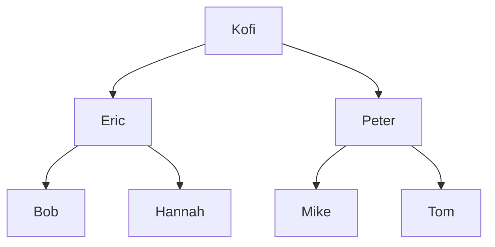
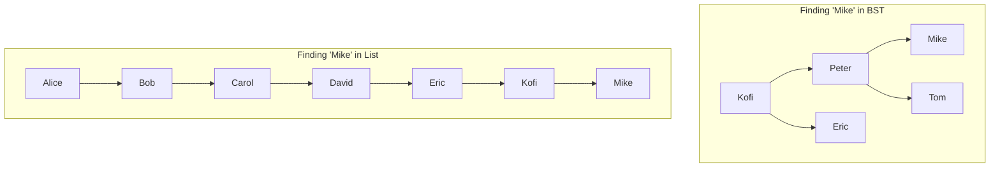
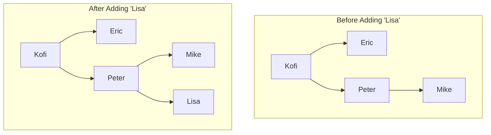
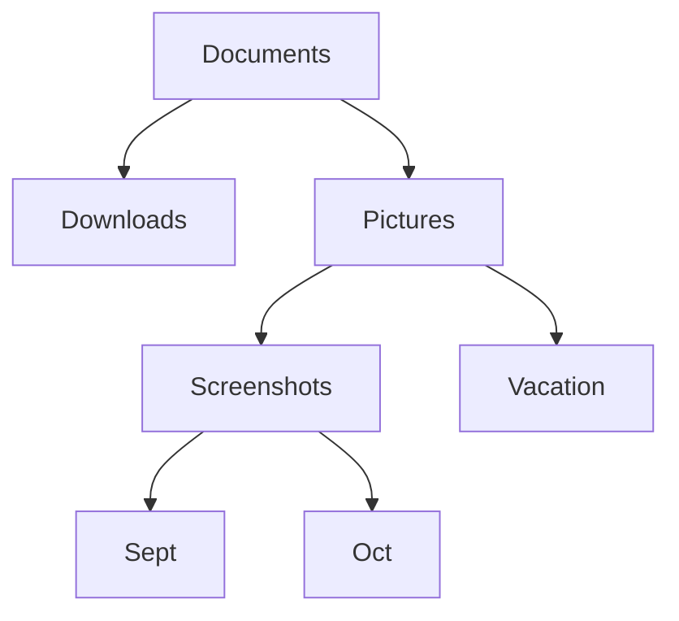
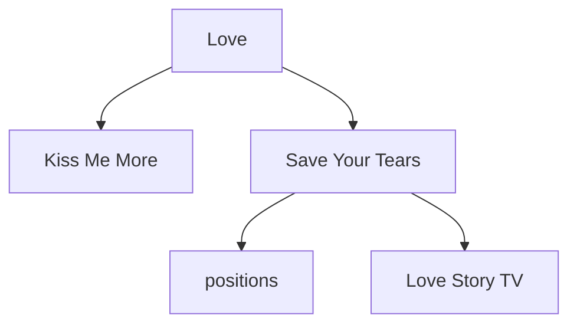
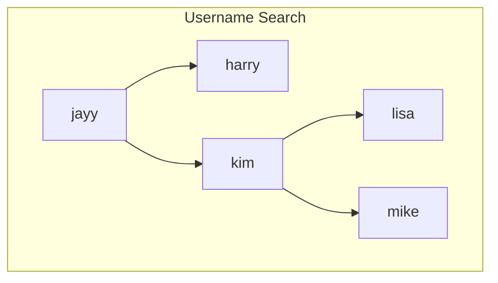
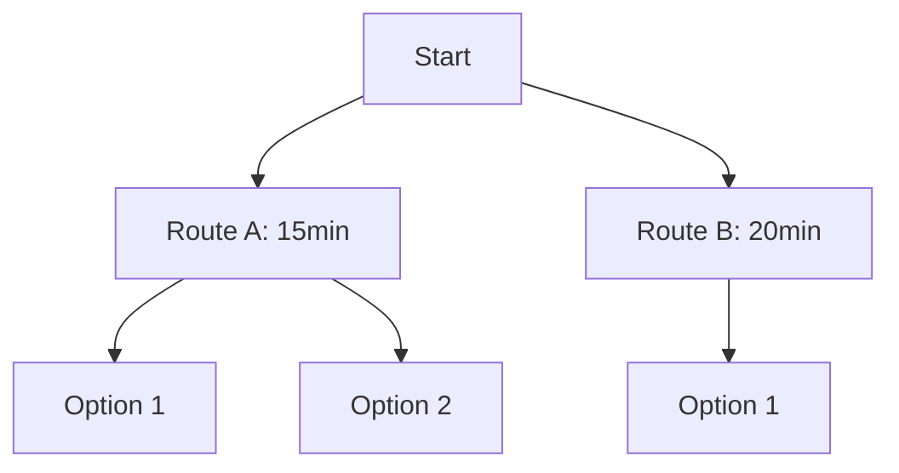
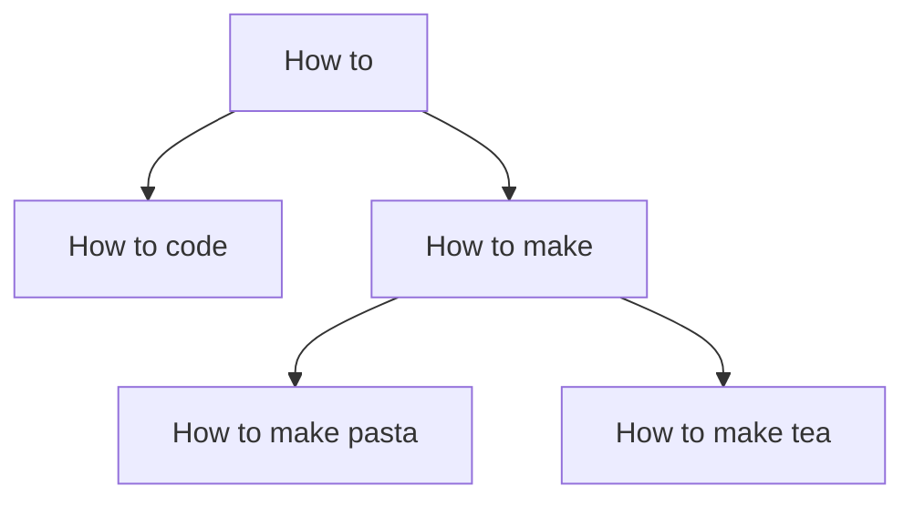
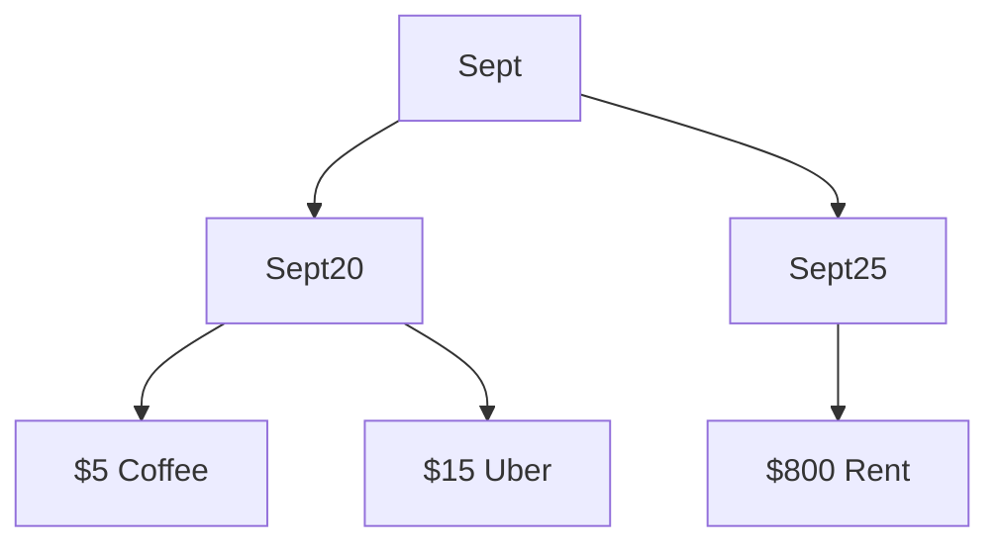
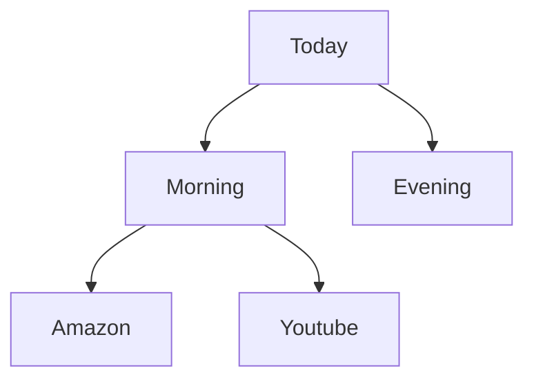

# Contact Management System using Binary Search Tree

This program implements a phone contact management system using a Binary Search Tree
for efficient contact storage and retrieval.

Features include:

- Adding and deleting contacts
- Searching contacts by name
- Contact categorization
- Automatic saving/loading of contacts

I wanted to write something clever so I wrote this.

## What's a BST Though?

Picture this - you're organizing your contacts like a family tree, but make it smart. Each contact is like a person in the tree, and they follow this one rule: everyone to their left comes before them alphabetically, and everyone to their right comes after them.

Let me show you what I mean:

See how clean that looks? Kofi's in the middle, Eric and everyone before 'K' is on the left, Peter and everyone after 'K' is on the right. It's like how you'd organize name cards at a wedding, but make it digital.

## Why BST Hit Different for Contacts

Real talk - I could've just used a regular list to store contacts. But here's why BST is that girl:

1. **Speed is CRAZY**

In a regular list, to find "Mike", you gotta go through EVERY. SINGLE. NAME. before Mike. With BST? You just go Kofi > Peter > Mike. Done. Three steps, not seven. When you're dealing with hundreds of contacts, this hits different.

## The Math Behind the Magic

Let me break it down:

- Regular list: Checking 500 contacts = up to 500 steps 😩
- BST: Checking 500 contacts = about 9 steps 🔥

This is what they call O(log n) vs O(n). Sounds fancy but really it just means BST is doing WORK.

## How It's Actually Helping Though

Think about what happens when you're:

1. **Adding a new contact**

2. **Finding someone's number**

- Regular list: "Let me scroll... scroll... scroll..."
- BST: "Left, right, found it!"

3. **Showing contacts in order**

- The tree literally organizes them alphabetically FOR YOU

## Why I Built It This Way

If you are searching something in a huge list, you want something that:

- Finds contacts FAST
- Keeps everything organized
- Doesn't lag when I'm searching
- Actually makes sense to use

That's why BST was the move. It's not just about being fancy with data structures - it's about making something that works better than what we already have.

## Thoughts

The way BST organizes data really got me thinking about how we organize things in real life. It's like how you'd organize a physical phone book - you don't check every page, you split it in half, then in half again, until you find what you need.

It's beautiful how something so logical and mathematical can feel so... natural? Like, it's exactly how our brains would organize things if we had to sort through 500 names.

Sometimes the best solutions are just digital versions of how we naturally think. That's what this project is about - taking something we all struggle with (managing contacts) and making it work the way our brains want it to work.

## BST in Your Everyday Life: Apps You Actually Use

You're probably using BSTs every day without even knowing it. Let me put you on.

### 1. File Explorer Things 📂

Your computer's file system? BST is all up in there. When you're looking for that one screenshot you took last week:

Windows and Mac both use BST-like structures to organize files. That's why when you hit Ctrl+F to find "screenshot_2023.png", it doesn't take 5 years even though you have thousands of files.

### 2. Spotify's Whole Thing 🎵

Ever wonder how Spotify finds songs so fast? When you search for "Love Story (Taylor's Version)":

Spotify's using BSTs to:
- Sort your playlists alphabetically
- Organize music libraries
- Handle those quick searches when you're trying to find that one song
- Keep track of your recently played

### 3. Instagram Following List 👥

When you check if someone's following you back (we all do it), Instagram's using BST-like structures to handle:
- Following/Followers lists
- Search suggestions
- Username lookups

### 4. Google Maps Navigation 🗺️

When you're trying to find the shortest route to that new restaurant:

Google Maps uses BST-like structures to:

- Find the shortest path
- Sort locations by distance
- Organize POIs (Points of Interest)
- Handle those "along your route" searches

### 5. Autocomplete in Your Search Bar ✨

You know when you start typing and Google's like "I know exactly what you're about to search"? BST behavior:

### 6. Discord Server Member List 💬

Ever notice how fast Discord loads members when you scroll through a server? They're using BSTs to:
- Organize member lists
- Handle role hierarchies
- Manage server permissions

### 7. Banking Apps 💸

When you're checking your transactions, your banking app is using BSTs to:
- Sort transactions by date
- Organize payees alphabetically
- Handle search when you're looking for that one Uber charge

### 8. Video Game Stuff 🎮

- **Minecraft**: BSTs help organize the game world and handle inventory
- **Among Us**: Player positions and task completion tracking
- **Battle Royale Games**: Managing player rankings and matchmaking

### 9. Chrome's History Feature 🌐

When you're trying to find that one website you visited last week:

Chrome uses BSTs to:

- Organize browsing history
- Handle bookmarks
- Manage those autocomplete suggestions

### 10. Database indexing (Kinda)

The reason it is fairly fast to retrieve records from a million rows in a table could be because of BST indexing. So databases don't use regular BSTs - they use this fancy cousin called B-trees. Think of it like a BST that got an upgrade.

## Why This Matters Though

Understanding BSTs isn't just about passing a DS class. It's about getting why some apps run smooth while others lag like crazy. Next time an app loads your stuff instantly, now you know - it's probably using a BST somewhere in there.

And that's why I used BST for this contact management system. If it's good enough for Spotify and Instagram, it's good enough for managing our contacts. Enjoy!
